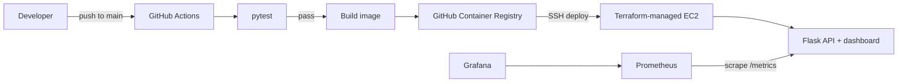

# Relay Ops: CI/CD-integrated DevOps pipeline

A small, persistent Flask task API packaged as a Docker service and deployed to an AWS EC2 host by GitHub Actions. Terraform defines the host and network rules; Prometheus scrapes application metrics and Grafana provisions a service dashboard.

## Architecture



## What is included

- Flask REST API with SQLite-backed task creation, listing, completion, and deletion.
- Single-operator sign-in with signed eight-hour sessions, CSRF-protected writes, and sign-out. Credentials come from environment variables; there is no public registration.
- Runtime health endpoint at `/api/health`, JSON overview at `/api/overview`, and Prometheus exposition at `/metrics`.
- Responsive control-room UI with live health, rolling request/latency/error summaries, deployment flow, and an interactive task manager.
- Docker image and Compose stack for the app, Prometheus, and Grafana. Grafana loads a provisioned dashboard automatically.
- Terraform for an Amazon Linux EC2 instance, security group, encrypted root volume, and bootstrap script.
- GitHub Actions that tests every push/PR, publishes a SHA-tagged GHCR image from `main`, then transfers monitoring configuration, restarts the VM stack, and checks app health.

## Run locally on Windows

For the full stack, use Docker Desktop with Compose. To run only the Flask app and tests, use Python 3.12 or newer.

1. Open PowerShell in the project folder and create your local environment file:

   ```powershell
   Copy-Item .env.example .env
   notepad .env
   ```

   `.env.example` contains demo-only credentials. Change the app password, Grafana password, and `APP_SECRET_KEY` before using the app beyond a local demo. Keep `.env` private; Git ignores it.

2. Start Docker Desktop and wait until its engine is running. Confirm that `docker info` displays Client and Server details. If `docker` is not recognized, add the per-user Docker CLI to this PowerShell session:

   ```powershell
   $env:Path = "$env:LOCALAPPDATA\Programs\DockerDesktop\resources\bin;$env:Path"
   docker version
   docker info
   ```

   Compose can parse its YAML without a running engine, but it cannot start containers until Docker Desktop has finished starting.

3. With Docker Desktop running, start the whole stack:

   ```powershell
   docker compose up --build
   ```

3. Open `http://localhost:8080`. The example sign-in is username `operator`, password `RelayOps-Demo-2026!` unless changed in `.env`. Grafana is at `http://localhost:3000`, username `admin`, using `GRAFANA_ADMIN_PASSWORD` from `.env`. Prometheus is internal to Compose. Stop with `Ctrl+C`, then run `docker compose down`; do not add `-v` unless you also intend to erase task and monitoring data.
4. Wait for the containers to start, then open `http://localhost:8080`. The example sign-in is username `operator`, password `RelayOps-Demo-2026!` unless changed in `.env`. Grafana is at `http://localhost:3000`, username `admin`, using `GRAFANA_ADMIN_PASSWORD` from `.env`. Prometheus is internal to Compose. Stop with `Ctrl+C`, then run `docker compose down`; do not add `-v` unless you also intend to erase task and monitoring data.

### Grafana says ERR_CONNECTION_REFUSED

That means nothing is listening on port 3000. From the project folder, check Docker and the Compose services:

```powershell
docker info
docker compose ps -a
docker compose up --build -d
docker compose ps -a
docker compose logs --tail 100 grafana
```

If Grafana is `Exited`, its logs show the startup error. If there are no containers, the Compose stack did not start. Check that `.env` exists and defines `GRAFANA_ADMIN_PASSWORD`, `APP_USERNAME`, `APP_PASSWORD`, and `APP_SECRET_KEY`. `docker compose config --quiet` checks configuration but does not start anything. If port 3000 is already occupied, change the Grafana mapping in `docker-compose.yml` to `"3001:3000"` and open `http://localhost:3001`.

### Exercise the project

Sign in to Relay Ops and use its `Task API` section to create a task, mark it complete, filter tasks, and delete it. Dashboard metrics refresh every 10 seconds. Grafana's provisioned `Relay Ops · Service overview` dashboard includes request volume, p95 latency, HTTP 5xx error rate, and task actions; generate traffic by using the dashboard or example script to populate those panels. Prometheus is available to Grafana inside Compose at `prometheus:9090`.

For an end-to-end PowerShell example that signs in, creates a task, lists it, completes it, reads the overview, and deletes it, run:

```powershell
.\examples\usage.ps1
```

The script asks for the app credentials using a secure prompt. It defaults to `http://localhost:8080`; set `$env:RELAY_OPS_URL` to change the app URL. It includes the session cookie and CSRF token for protected API requests.

To run Flask directly instead of Docker, create and activate a virtual environment, install requirements, then run the app:

```powershell
py -3.12 -m venv .venv
.\.venv\Scripts\Activate.ps1
python -m pip install -r requirements-dev.txt
python app.py
```

Open `http://127.0.0.1:8000`. To run the same checks as CI, open another PowerShell in the project folder, activate `.venv`, and run `pytest -q`. The app loads local values from `.env` using `python-dotenv`.

## Deploy to AWS

Cloud resources can incur charges. Check current AWS pricing and free-tier eligibility for your account and region before applying. The sample uses a `t3.micro`, a 20 GiB encrypted volume, and a default VPC; it does not configure TLS, a domain, a managed database, or an automatic backup. The app port is public for the demo. SSH and Grafana are restricted to the administrator CIDR.

1. Create or choose an EC2 key pair and find your current public IP in CIDR form (usually `/32`). Install Terraform and configure AWS credentials in your local shell with permissions for EC2, VPC discovery, and security groups. AWS credentials are only used by your local Terraform commands; this workflow does not need AWS access keys in GitHub.
2. From `terraform/`, copy `terraform.tfvars.example` to `terraform.tfvars` and set `ssh_key_name` and `admin_cidr`. Review the plan, then run:

   ```powershell
   terraform init
   terraform fmt -check
   terraform validate
   terraform plan
   terraform apply
   ```

3. Set these repository **Actions secrets** before pushing to `main`:

   - `DEPLOY_HOST`: the EC2 public IPv4 address from `terraform output -raw public_ip`.
   - `DEPLOY_SSH_KEY`: private key matching the EC2 key pair. Keep it only in GitHub Secrets.
   - `GHCR_USERNAME`: GitHub username that owns the package read token.
   - `GHCR_READ_TOKEN`: GitHub personal access token with `read:packages` permission for the image. If the package is public and anonymous pulls are enabled, deployment can be adapted to omit registry login.
   - `APP_USERNAME`: dashboard operator username.
   - `APP_PASSWORD`: strong dashboard password.
   - `APP_SECRET_KEY`: long, random Flask session-signing secret. Generate one locally with `python -c "import secrets; print(secrets.token_urlsafe(48))"` and save it only in GitHub Secrets for deployment.
   - `GRAFANA_ADMIN_PASSWORD`: a strong Grafana admin password.

4. Ensure the GitHub Actions workflow has package write permission and the GHCR package is available to the workflow. An opened Grafana URL listens only from the configured `admin_cidr`.
5. Push to `main`. Tests, container build, and Terraform checks must pass before the image is published; deployment then pulls the immutable commit-SHA tag and probes `/api/health`. The workflow fails if the health check does not recover.

Use a separate, narrowly scoped read-only package token for the VM where possible. Rotate credentials if exposed. Terraform state can contain sensitive infrastructure details; keep local state and `terraform.tfvars` private. The app currently serves HTTP directly: do not send real credentials over a public network until HTTPS is configured. Set `COOKIE_SECURE=true` after placing it behind HTTPS.

## Useful endpoints

| Method | Path | Purpose |
| --- | --- | --- |
| `GET` | `/api/health` | Container liveness check |
| `GET` | `/api/overview` | Authenticated runtime and task summary |
| `GET` | `/api/tasks` | Authenticated task list |
| `POST` | `/api/tasks` | Authenticated create `{ "title": "..." }` with CSRF header |
| `PATCH` | `/api/tasks/<id>` | Authenticated update `{ "completed": true }` with CSRF header |
| `DELETE` | `/api/tasks/<id>` | Authenticated delete with CSRF header |
| `GET` | `/metrics` | Prometheus metrics scrape |

`/api/health` and `/metrics` are intentionally public to the container health check and Prometheus. Dashboard pages and task APIs require the operator login. The task database is stored in the `app_data` Docker volume, so replacing the app container does not remove tasks. The dashboard exposes rolling in-process request summaries; Grafana uses Prometheus histogram queries for time-series p95 latency and error-rate panels.

## Tear down

From `terraform/`, run `terraform destroy` when the demo is no longer needed. This removes the EC2 instance and security group. AWS charges may still apply to any separately retained or snapshotted resources.

## Next improvements

- Put the service behind HTTPS with a domain, load balancer, and managed certificate.
- Replace SQLite with RDS PostgreSQL and add tested backup/restore procedures.
- Add a deployment rollback strategy that pins and redeploys the prior known-good image.
- Add alert rules, notification routing, and a black-box uptime probe.
- Use OIDC from GitHub Actions for AWS access and a managed secret store instead of long-lived credentials.
- Move Terraform state to a locked, encrypted remote backend before team use.
